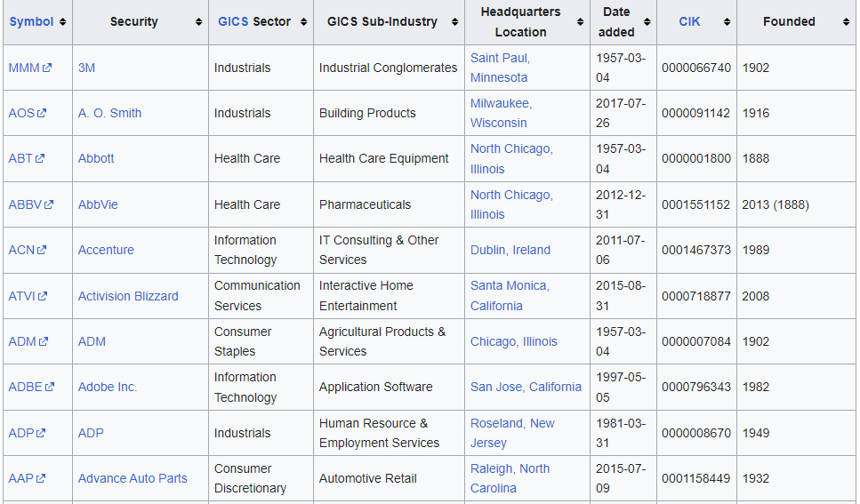
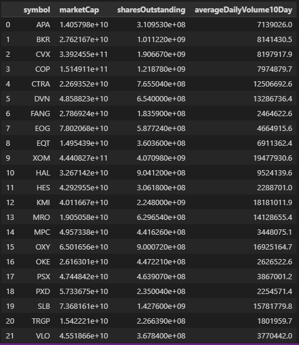
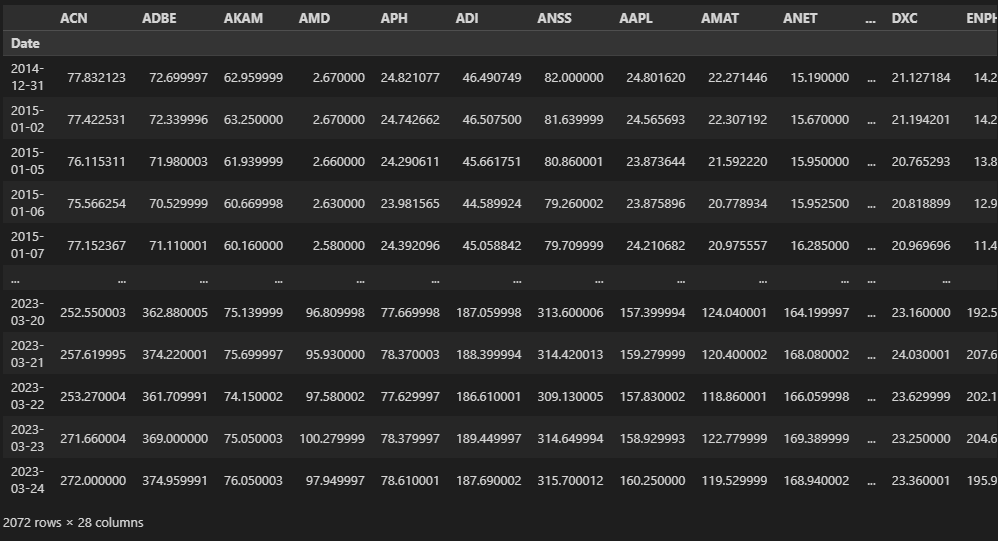
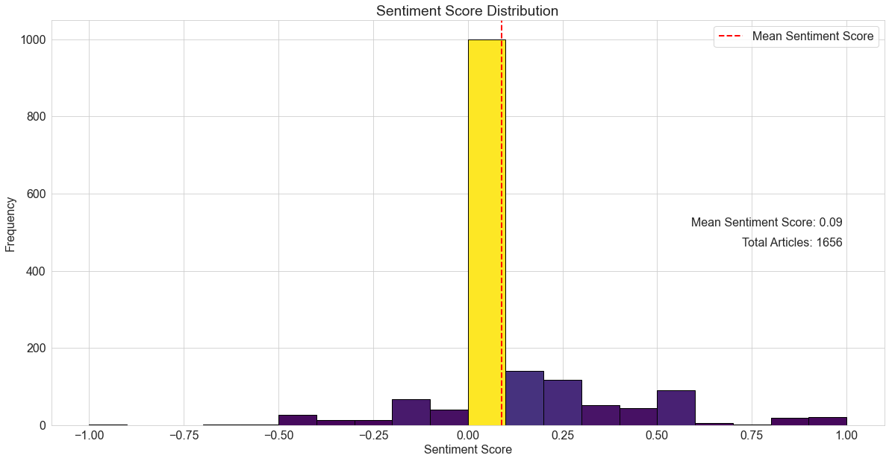
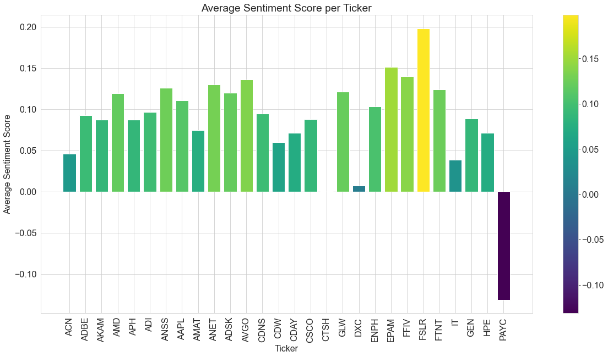
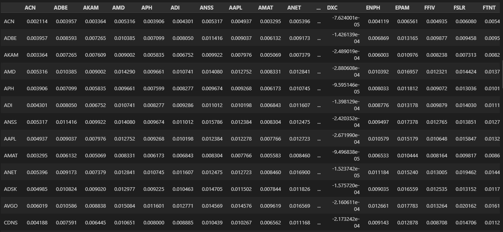
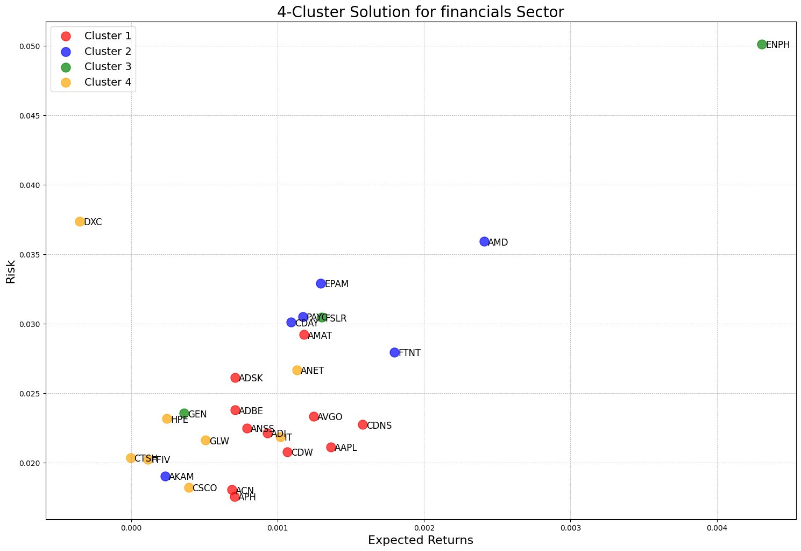
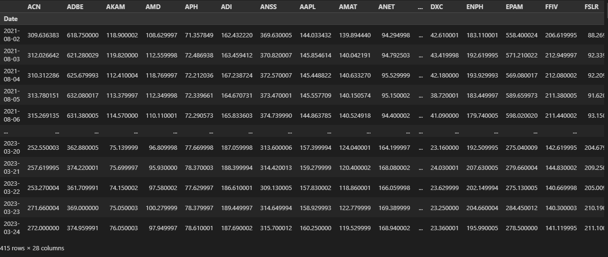
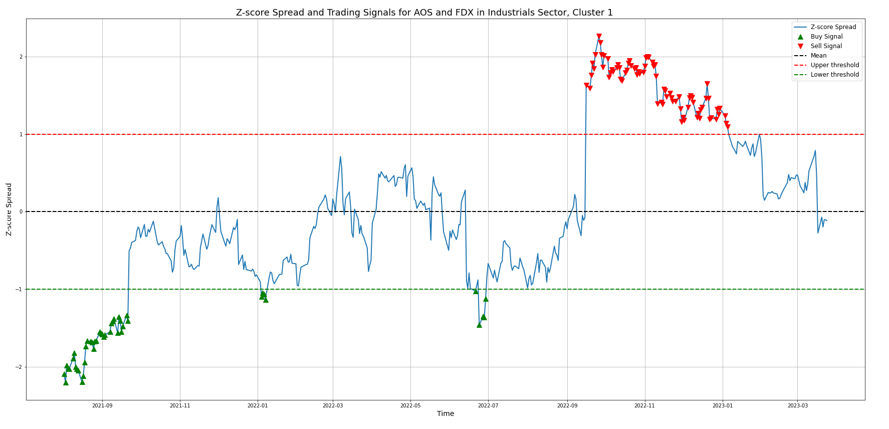
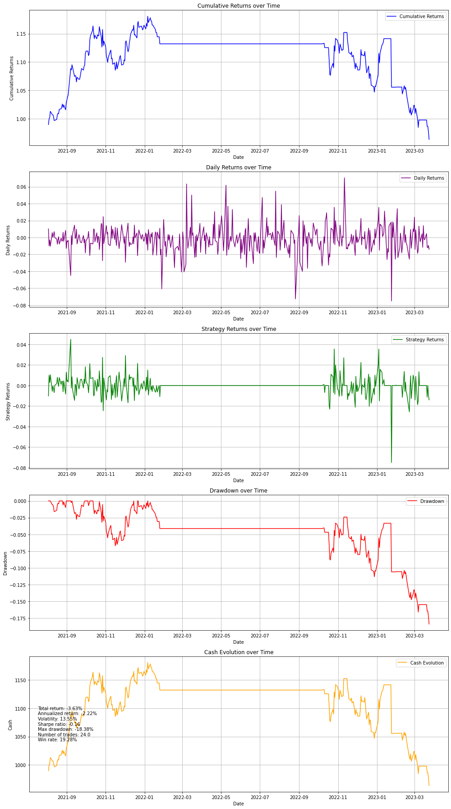

# Deploying a Pairs Trading Platform in the Equity Market Using Advanced Data Techniques

## Step 1: Stock Selection Using Alpha Vantage API and Filtering Criteria
In this step, we will outline the initial step in our pairs trading strategy: selecting a universe of stocks from a specific sector or industry, identifying stocks within that sector or industry, and applying filtering criteria based on market capitalization, liquidity, and trading volume. Pairs trading is a market-neutral trading strategy that involves identifying and trading correlated stocks to profit from temporary discrepancies in their price relationship. By focusing on a specific sector or industry, we can identify stocks with a higher potential for correlation, which is crucial for the success of a pairs trading strategy. We have chosen the S&P 500 index as our stock universe, as it represents a diverse range of large-cap companies across various sectors, providing a comprehensive selection of stocks to choose from for our strategy.

#### 1.	Data Collection:
   We start by collecting the constituents of the S&P 500 index from a publicly available source, such as Wikipedia.
   <figure>
  
</figure>

##### Snapshot of the components of the SP500 in Wikipedia table.
We use the Pandas library to read the HTML table containing the list of S&P 500 companies and their corresponding sectors (GICS Sectors) directly into a DataFrame. This dataset provides us with the necessary information to filter stocks based on a specific sector of interest.

##### All sectors of the components of the SP500 in Wikipedia table.

#### 2.	Selecting a Sector: 

In our analysis, we have focused on the following sectors: **Energy, Real Estate, Communication Services, Information Technology, Health Care, Industrials, and Financials**. By working with these sectors, we aim to cover a diverse range of companies and industries within the S&P 500 index.

#### 3.	Fetching Stock Data with Alpha Vantage API:

We use the *Alpha Vantage API* to fetch stock data, including the daily-adjusted time series and company overview for each stock in the selected sector. 

#### 4.	Defining Filtering Criteria: 
To select stocks based on specific criteria, we define the following filtering criteria in our code:

- **Market Capitalization:**  To select stocks based on market capitalization, we set a minimum and maximum market capitalization range to focus on stocks with a market capitalization between 2 million USD and 10 billion USD. This range is chosen to target mid-cap companies. By focusing on this market capitalization range, we aim to identify stocks that have the potential for strong performance while maintaining a manageable level of risk for our pairs trading strategy.
- **Liquidity Ratio:**  We define a liquidity ratio to ensure that stocks have a sufficient amount of liquidity for trading. By setting this ratio, we aim to select stocks that exhibit a reasonable level of trading activity, ensuring that our pairs trading strategy can be executed efficiently. 
- **Average Daily Trading Volume:** We set a minimum average daily trading volume of 500,000 shares to ensure that the selected stocks have adequate trading activity. This threshold helps to ensure that our pairs trading strategy can be implemented efficiently.

#### 5.	Filtering Stocks: 

We loop through the stocks in the selected sector and fetch their data using the Alpha Vantage API. We calculate the market capitalization, liquidity ratio, and average daily trading volume for each stock, and then apply our filtering criteria to select the stocks that meet these criteria. 

##### Example of the components of the SP500’s energy sector.

## Step 2: Gathering Historical Price Data for Selected Stocks
In this step, we discuss the process of collecting historical price data for the selected stocks identified in the previous step. We have chosen a specific set of stocks based on their market capitalization, liquidity, and trading volume. This data collection is crucial for the development of our pairs trading strategy, as it provides us with the necessary information to identify potential pairs with a high degree of statistical similarity.
To begin the data collection process, we first set the time period for our historical price data. We have chosen a start date of *January 1, 2015*, and an end date of *March 26, 2023*. 

After setting the time period for data collection, we proceed to gather the historical price data for each of our selected stocks. We use the **yfinance** library to fetch this data, focusing specifically on the *adjusted closing prices*. 

To ensure the quality of our dataset, we check for missing data points and fill any gaps using *linear interpolation*. This method estimates the missing values by assuming a linear relationship between the adjacent data points, providing a reasonable approximation for our analysis.

##### Example of the Adjusted Close data of the financial sector.

## Step 3: Clustering and Visualization of Selected Stocks

In this step, we will explore the use of clustering algorithms and visualization techniques to analyze the relationships between selected stocks based on their historical price data and sentiment scores. Our objective is to identify clusters of stocks that exhibit similar risk and return characteristics, and to use this information to inform our pairs trading strategy.

#### 1.	Calculate the adjusted correlation matrix: 

We loop through the stocks in the selected sector and fetch their data using the Alpha Vantage API. We calculate the market capitalization, liquidity ratio, and average daily trading volume for each stock, and then apply our filtering criteria to select the stocks that meet these criteria. 

The correlation matrix, a fundamental tool in financial markets, quantifies the degree to which different stock prices move in sync, thus enabling the construction of diversified portfolios. However, its limitation lies in solely considering historical price data, neglecting other influential factors such as investor sentiment.

Investor sentiment often sways stock prices. A positive news story about a particular stock, for example, might increase investor optimism and subsequently boost its price. This price increase could stir interest among other investors, leading to further price escalations, even in the absence of a fundamental basis for such a rise.

To address this shortfall and incorporate the influence of investor sentiment on stock correlations, sentiment scores are introduced into the correlation matrix. These scores are calculated through a comprehensive sentiment analysis of news articles, social media posts, and other information sources related to each stock. The sentiment scores serve to adjust the correlation matrix, making it reflective of the impact of investor sentiment on the relationships between stocks.

The integration of sentiment scores into the correlation matrix involves multiplying the original matrix by the sentiment scores. This procedure adjusts the correlation strengths between stocks in accordance with their sentiment scores. For instance, if two stocks both have high positive sentiment scores, their correlation will be heightened, mirroring the positive perception of investors. Conversely, if two stocks carry low sentiment scores, their correlation will be reduced, indicating their negative standing among investors.

The culmination of this process is an adjusted correlation matrix that provides a more accurate depiction of the relationships between stocks, factoring in the effects of investor sentiment. This adjusted matrix can then be used for further analysis, such as grouping stocks based on their correlations and using these clusters to guide investment decisions.

To further elucidate the sentiment scores, visual representations were created using two types of graphs. A histogram was used to display the distribution of sentiment scores across all articles, with each bar representing the frequency of articles with a particular sentiment score. This enabled a clear visualization of the overall sentiment distribution. A bar plot was also constructed to show the average sentiment score for each stock, offering a direct comparison of sentiment across different stocks. The color intensity in the bar plot corresponded to the sentiment score, providing an additional layer of information.

These visualizations, combined with the adjusted correlation matrix, provide a more deep understanding of the complex dynamics of financial markets, harnessing the power of Natural Language Processing and Sentiment Analysis to offer insights that go beyond mere price data.

The resulting adjusted correlation matrix provides a more accurate measure of the relationships between stocks, taking into account the impact of investor sentiment on those relationships. This can be used as the basis for further analysis, such as clustering the stocks into different groups based on their correlations, and using these groups to inform investment decisions.

##### Extract from the adjusted correlation matrix of the financial sector.

#### 2.	Cluster the stocks based on the adjusted correlation matrix:

After calculating the adjusted correlation matrix, we use the **k-means** clustering algorithm to cluster the stocks based on their similarities in terms of adjusted correlation matrix. **K-means** is a popular unsupervised machine-learning algorithm used for clustering data points into groups or clusters based on their similarities. In our case, the algorithm uses the adjusted correlation matrix as input and groups the stocks into the desired number of clusters.

In our case, we set the number of clusters to *four*, which is a reasonable number based on the size of our dataset and the desire to have a manageable number of clusters for further analysis. By clustering the stocks based on their similarities in terms of the adjusted correlation matrix, we can identify groups of stocks that are likely to move together and potentially use this information in our pairs trading strategy.

#### 3.	Visualize the clustering results:

We use a scatter plot to visualize the clustering results, with each stock represented by a point in the plot. We assign a color to each point based on the cluster to which it belongs, and label the points with the corresponding stock symbols.

##### Cluster Analysis of Selected Stocks based on Adjusted Correlation Matrix of the financial sector.

## Step 4: Mean Reversion Trading Strategy: Exploratory Data Analysis, Pair Selection, and Performance Evaluation

This step presents a detailed exploratory data analysis and financial modeling focused on the adjusted close prices for stocks in the financial sector. The primary objective is to unearth pairs of stocks that exhibit mean-reverting behavior which, when properly managed, can result in profitable trading strategies. 

#### 1.	Data Acquisition and Preprocessing 

The first step involves the procurement of the necessary financial data. This data is typically composed of historical adjusted close prices for the financial sector and is retrieved from specific CSV files, each signifying a distinct group of stocks.
Once the data is acquired, preprocessing is undertaken to ensure the data is apt for analysis. The preprocessing stage involves splitting the data for each cluster of stocks into **training** and **testing** sets. The training set comprises *80%* of the total data, while the remaining *20%* is kept for testing.

##### Adjusted Close Prices in the Financial Sector: A Testing Set Snapshot from August 2, 2021 to March 24, 2023

#### 2.	Pair Selection and Analysis
##### 2.1. Correlation and Cointegration
In this phase of our analysis, we begin by calculating the **correlation** between each pair of stocks within a given cluster. **Correlation** measures the statistical relationship between two securities. A correlation coefficient ranges between *-1 and +1*. The closer it is to *+1*, the more positive the **correlation**, meaning the two stocks move in tandem. Conversely, a **correlation** closer to *-1* indicates a negative correlation, signifying that the stocks move inversely.

However, **correlation** is not enough for the pair selection process in trading strategies. It is transient and does not guarantee that the relationship between the pair will persist over time. That's where **cointegration** comes into play. **Cointegration** checks if a linear combination of two series is stationary, *i.e., their spread remains constant over time*. This is done using a function that checks for cointegration based on a predetermined significance level. The pairs that pass this **cointegration** test are considered for the next phase of the analysis.

##### 2.2. Residual Calculation and Mean-Reversion Testing: Analyzing Z-score Spread for Trading Signals

Following the identification of cointegrated pairs, the next step is to calculate residuals. These residuals are then standardized to have a mean of zero and a standard deviation of one, which helps in comparing residuals across different pairs.

After calculating the residuals, we scrutinize these pairs for mean-reverting behavior using the *Augmented Dickey-Fuller (ADF)* test. The *ADF test* is a common statistical test that checks if a time series is stationary or not. **In the context of pair trading, a stationary spread indicates that the spread between the pair of stocks is mean-reverting**, *i.e., it tends to revert to its mean over time*, which is the crucial characteristic for the pair trading strategy.

Pairs that pass the ADF test are considered suitable for the mean reversion trading strategy, as they are likely to exhibit a stable relationship over time, making them predictable and potentially profitable.

##### 2.3. Iterative Pair Analysis within Clusters

In the next stage of our analysis, we take a close look at each group of stocks. We're looking for pairs of stocks that might be good for trading. To do this, we look at a few key things: how closely the stocks move together, how much they tend to bounce back to a normal value, how much their values tend to change, and how steady the difference between their prices is.

We're particularly interested in pairs of stocks that are closely connected and have a strong tendency to bounce back to a normal value. These pairs are more likely to have a steady price difference, which makes them a good fit for a specific type of trading strategy called *mean reversion*.

We go through this process carefully and step by step for each group of stocks. This helps us to keep improving our choices and find the best pairs in each group. The result is a carefully selected list of pairs for each group, chosen through a thorough and rigorous process.

Our work in finding the best pairs in each group makes sure we select pairs that are most likely to do well in a mean reversion trading strategy. This shows the value of our detailed and thorough approach in finding good trading opportunities in the stock market.

#### 3.	Performance Calculation and Visualization

Once we have chosen our pairs of stocks, we move on to a detailed performance evaluation for each pair. This is done using a function we call **calculate_performance()**. This function needs several pieces of information to work: *the z-score spread of the pair, the test dataset, the upper and lower trading thresholds, the initial cash, and the stop loss level*.
Based on these inputs, the function then calculates a variety of performance measures. These include:

- **Final Cash:**  This metric represents the remaining cash balance after all trading operations have been executed. It provides an absolute understanding of the strategy's profitability and is calculated directly from the last value of the cash balance in our dataset. A higher value signifies a profitable strategy.
- **Total Return:**  This metric calculates the overall profitability of the trading strategy as a percentage. It's computed by dividing the final cash by the initial cash, subtracting one, and multiplying by 100 to get a percentage. The total return gives a summary of the strategy's performance over the entire investment horizon. A higher total return indicates a more successful strategy.
- **Annualized Return:** The annualized return is the geometric mean return for an investment over a period, scaled to an annual basis. It allows comparison of the strategy's performance with other investments or benchmarks over a common annual period. A higher annualized return shows the strategy has been more profitable on an annual basis.
- **Volatility:** Volatility is a statistical measure of the dispersion of returns for a given security or market index. Higher volatility indicates a higher risk associated with the trading strategy.
- **Sharpe Ratio:** The Sharpe Ratio measures risk-adjusted performance. A higher Sharpe ratio indicates better risk-adjusted performance.
- **Maximum Drawdown:**  This is the maximum observed loss from a peak to a trough of a portfolio, before a new peak is attained. Lower values are better as this means the strategy recovers more quickly from losses.
- **Number of Trades:** This simply signify the total count of executed trades. This metric provides an understanding of how active the trading strategy is. More trades may lead to higher transaction costs, and may also indicate a higher risk strategy.
- **Win Rate:**  The win rate is the ratio of the number of profitable trades to the total number of trades, expressed as a percentage. It provides insight into the reliability of the strategy. A higher win rate means the strategy is more consistent in generating profits.

We also track the growth of returns, the swings in daily returns, the evolution of strategy returns, the depth and duration of any downturns, and the overall cash growth.

Having these visual plots along with numerical metrics gives us a well-rounded view of our strategy's performance. It's not just about how much we're making, but also how we're making it - and how much risk we're taking along the way. This detailed evaluation helps us understand both the benefits and the risks of our chosen trading strategies.

## Conclusion: 
In conclusion, this project outlines a thorough methodology for financial data analysis, specifically targeting mean reversion trading. We identified pairs of stocks using correlation and cointegration tests, applied the Mean Reversion Trading Strategy, and evaluated its performance. 

